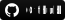

### Hola 👋 
### ¡Este es Fernando Montes De Oca!
<code></code>
[<code></code>](https://github.com/FerCodev)
[<code></code>](https://www.linkedin.com/in/montes-de-oca/)[<code> </code>](mailto:fernando.proff@hotmail.com)

¡Bienvenido a mi página de Github! ¡Soy Fernando!  

#### 🌱 Proyectos en curso actualmente: 
- UpTask (proyecto de gestion de tareas realizado en Node)  
- Mi propio sitio web  [FerCode] (https://fercode.com.ar/) 
- 

#### 💪 Cosas con las que me estoy desafiando:
- Despertarse más temprano para aprovechar bien el día
- Codificar al menos 4 horas al día
- Hacer ejercicio 3 días a la semana
- Dominar JavaScript.

####: computadora: Lenguajes y herramientas de programación:

	

<code>  </code>
<code>  </code>
<code>  </code>
 
<code>  </code>
<code>  </code>
<code>  </code>
 
<code>  </code>
<code>  </code>
<code>  </code>

